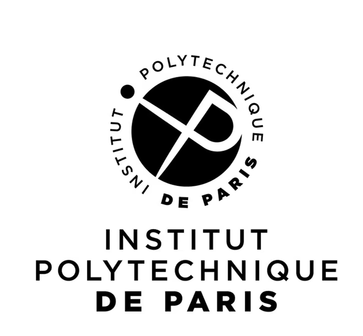



Education
------ 
* M.S. in Paris, École Polytechnique, 2024-now 
* M.S. in Paris, Institut polytechnique de Paris, 2024-now
  * major in Cyber Physic System
* B.S. in Beijing, Beijing University of Posts and Telecommunications, 2020-2024
  * major in Computer Science and Technology
    
Intership
------
* 2023.10-2024.5: Java & Python development engineer
  * iQiyi, Beijing

* 2023.11-now1: Research intern
  * Beijing University of Posts and Telecommunications, Beijing
  * Supervisor: Li Xiao
  
Service and leadership
------
* 1111
